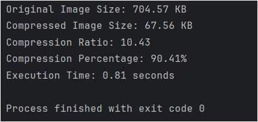
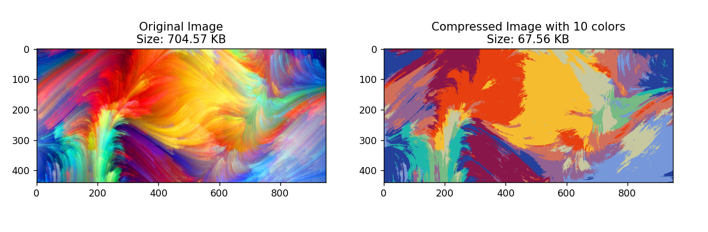

# Image Compression Using K-Means Clustering

This project demonstrates how to use the K-Means clustering algorithm to compress an image by reducing its color palette. By clustering the pixels in an image into a specified number of color clusters, the algorithm replaces all the pixels in each cluster with the color of the cluster's centroid, effectively reducing the image's file size while maintaining its visual quality.

* Features

Compress an image by reducing the number of colors using K-Means clustering.
Display the original and compressed images side by side.
Calculate and display the compression ratio and percentage.
Record and display the execution time for the compression process.
---
* Requirements

  * Python 3.x
  
  * numpy
  
  * scikit-learn
  
  * Pillow
  
  * matplotlib
---
* Installation
  
  * To install the required dependencies, clone the repository and use pip to install the dependencies listed in the requirements.txt file.
    
  * Clone the repository:
    * `git clone https://github.com/ishitasinghfaujdar/ImageCompression.git
`
  * Navigate into the project directory:
    * `cd ImageCompression
`
  * Install the required packages:
    * `pip install -r requirements.txt
`
---
* Usage

  * Place your image (e.g., sample_file.png) in the project directory.

  * Run the compression script:
  `python main.py
  ` if main.py is what you have named your source code file.

  The script will:

  * Compress the image by reducing the number of colors to 10(you can change this in the code).
  * Save the original and compressed images in the directory.
  * Display the original and compressed images side by side in a plot.
  * Print the compression ratio, percentage, and execution time.
# Example
If you have an image named `sample_file.png`, the script will compress the image, and you’ll see two images displayed:
* The original image.
* The compressed image with reduced colors.

*NOTE: This method works best with PNG images and vector or GIF type formats.*
# Sample Output
The script will output:

* The original image size and compressed image size.
* The compression ratio (the ratio of the original size to the compressed size).
* The compression percentage (how much smaller the compressed image is compared to the original).
* The execution time taken for the compression process.

SAMPLE OUTPUT

# How It Works
The compression process works by performing K-Means clustering on the image pixels:

The image is loaded and converted into an array of pixels.
The K-Means clustering algorithm is applied to these pixels to group them into clusters based on color similarity.
Each pixel is assigned to the closest cluster, and the pixels in each cluster are replaced with the color of the cluster's centroid.
The compressed image is then saved and displayed.
The number of colors in the image can be controlled by setting the num_colors variable in the script.

IN SIMPLE WORDS-

Imagine you have a big box of crayons with lots of colors: red, blue, green, yellow, purple, and so on. When you look at all these crayons, you see that some colors are very similar to each other, like light blue and sky blue. Others might be dark green and forest green. You can tell that while all these colors are different, some of them are close to each other.

* Technical Term: Data Points (Pixels)
In real life, each crayon is like a pixel in an image. Each pixel has its own color, which is made up of three main colors: Red, Green, and Blue (RGB). The colors of all these pixels can be quite different, just like the different crayon colors.

* Step 1: Grouping the Crayons into Families (Technical Term: Clustering & K-Means Algorithm)
Now, you want to make things simpler. So instead of using every single color in your picture, you want to group similar colors together into families. For example:

    * Family 1: Light blue, sky blue, ocean blue
    * Family 2: Dark green, forest green, olive green 
    * Family 3: Bright red, cherry red, ruby red
* Step 3: Assign Each Crayon to a Family (Technical Term: Assigning Labels)
  * this is where K-Means labels each crayon with a family number (label). 
    For example:
    * Light blue gets label 1 (because it’s part of Family 1).
    * Forest green gets label 2 (because it’s part of Family 2). 
    * Cherry red gets label 3 (because it’s part of Family 3).
* Step 4: Use Only the Family's Main Crayon to Color (Technical Term: Reconstructing the Image)
  * In K-Means, after assigning labels to each pixel, we replace each pixel's original color with the centroid of its family. The centroid is just the average color of all the pixels in that family. This is like replacing every crayon in Family 1 with just the main blue color that best represents it.
* Step 5: Now You Have a Simpler Picture ( Technical Term: Image Compression)

  This way, you are not using every single crayon; you're only using one crayon per family.
# License

This project is licensed under the MIT License - see the LICENSE file for details.

# Acknowledgements

The K-Means clustering algorithm is provided by the scikit-learn library.
Image compression and color quantization techniques inspired by general image compression methods.
  